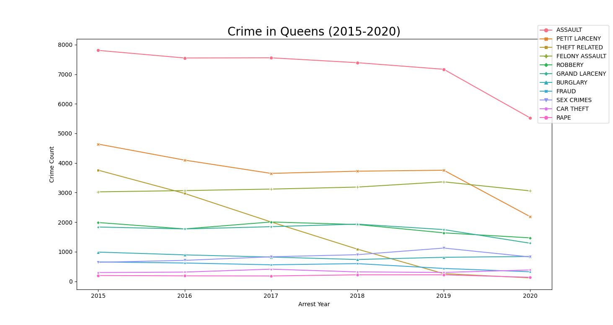

 <h2><u> The Trend of Crime in Queens NYC </u></h2>
Your sense of safety largely depends on the crime rate and homeless rate of where you live. Some area's of the city have suffered an increase in crime since the COVID-19 outbreak , and some areas of the city have suffered a high crime rate historically. I will use python to visualize those trends and categorize which neighborhoods have had an increase in crime since covid. This analysis is trying to identify the trend of crime in Queens.

<h2><u>The Data</u></h2>
   <p> <a href="https://data.cityofnewyork.us/Public-Safety/NYPD-Arrests-Data-Historic-/8h9b-rp9u/data" target="_blank" > Historic crime data</a> </p>
  <p><a href="https://data.cityofnewyork.us/Public-Safety/NYPD-Arrest-Data-Year-to-Date-/uip8-fykc " target="_blank" >Recent crime data   </a></p>
   <p> <a href="https://data.cityofnewyork.us/Public-Safety/Police-Precincts/78dh-3ptz" target="_blank" > Police precincts GeoJson</a></p>
 


<h2><u>The Code</u></h2>
<a href="https://github.com/elchic00/CrimeInQueens/blob/main/CrimeData.py" target="_blank" > Repository to the Python code</a>
```
'''
Name: Andrew Alagna
Email: andrew.alagna98@myhunter.cuny.edu
Resources: I spoke with St. John during the planning phase to decide how to cut down my data to a more reasonable size. I used data from - https://data.cityofnewyork.us/Public-Safety/NYPD-Arrests-Data-Historic-/8h9b-rp9u/data, https://data.cityofnewyork.us/Public-Safety/Police-Precincts/78dh-3ptz, https://data.cityofnewyork.us/Public-Safety/Police-Precincts/78dh-3ptz 
Title: Crime in Queens: The Trend of Crime Historically and After the Covid-19 Outbreak
Theme: Social-justice
'''
import pandas as pd
import numpy as np
import seaborn as sns
import matplotlib.pyplot as plt
import json
import folium
import os
import webbrowser

##CLEANING DATA AND SEPERATING INTO DATAFRAMES.##
hist = pd.read_csv('NYPD_Arrests_Data__Historic_.csv')
recent = pd.read_csv('NYPD_Arrest_Data__Year_to_Date_.csv')
# Filter DF to only include precincts in queens (100-115)
hist = hist[hist['ARREST_PRECINCT'] >= 100]
recent = recent[recent['ARREST_PRECINCT'] >= 100]

# # Get stratified sampling of my data by proportion.
# stratSampHis = hist.groupby('ARREST_BORO', group_keys=False).apply(
#     lambda x: x.sample(int(np.rint(100000 * len(x) / len(hist))))).reset_index(drop=True)

# Change arrest date to datetime
hist['ARREST_DATE'] = pd.to_datetime(hist['ARREST_DATE'])
recent['ARREST_DATE'] = pd.to_datetime(recent['ARREST_DATE'])

# Find the average crime count after the shutdown in march and the average crime rate of the last 5 years, then compare.
crimeCountrec = recent.groupby(['ARREST_PRECINCT'])['OFNS_DESC'].value_counts().reset_index(name='Crime Count')
# Get all dates after the shutdown in march of 2020.
hisAfPand = hist[hist.ARREST_DATE > '2020-03-11']
#Count the average crime by offense type and find the average per year after march 2020.
hisAfPand = hisAfPand.groupby(['ARREST_PRECINCT'])['OFNS_DESC'].value_counts().reset_index(name='Crime Count')
hisAfPand['Crime Count'] = round((hisAfPand['Crime Count'] + crimeCountrec['Crime Count'])/1.67)

# Average crime rate over the last 5 years
hisToPand = hist[hist.ARREST_DATE <= '2020-03-11']
histAvg = hisToPand.groupby(['ARREST_PRECINCT'])['OFNS_DESC'].value_counts().reset_index(name='Crime Count')
histAvg['Crime Count'] = round(histAvg['Crime Count']/5.225)
histAvg.rename(columns = {'Crime Count':'Crime Count Historic Avg'},inplace = True)

# Merge histAvg and recentAvg and add new column to df to check if there was an increase in crime since covid.
merged = pd.merge(histAvg, hisAfPand)
# Make a new column to say if average crime rate of the last five years has increased since the shutdown.
merged['Increase in Crime'] = merged['Crime Count Historic Avg'] < merged['Crime Count']
print(merged)
# print(merged[['ARREST_PRECINCT','OFNS_DESC','Increase in Crime']])
merged.to_csv('merged.csv')


# Make arrest date only have the year to filter by year
hist['ARREST_DATE'] = hist.ARREST_DATE.dt.year

# Clean crimes to combine similar types of crime as one to count.
recent.OFNS_DESC = recent['OFNS_DESC'].apply(lambda x: 'FRAUD' if 'FRAUD' in x else x)
recent.OFNS_DESC = recent['OFNS_DESC'].apply(lambda x: 'STOLEN PROPERTY' if 'STOLEN PROPERTY' in x else x)
recent.OFNS_DESC = recent['OFNS_DESC'].apply(lambda x: 'ASSAULT' if 'ASSAULT 3' in x else x)
recent.OFNS_DESC = recent['OFNS_DESC'].apply(lambda x: 'CAR THEFT' if 'GRAND LARCENY OF MOTOR VEHICLE' in x else x)
hist.OFNS_DESC = hist['OFNS_DESC'].apply(lambda x: 'FRAUD' if 'FRAUD' in x else x)
hist.OFNS_DESC = hist['OFNS_DESC'].apply(lambda x: 'CAR THEFT' if 'GRAND LARCENY OF MOTOR VEHICLE' in x else x)
hist.OFNS_DESC = hist['OFNS_DESC'].apply(lambda x: 'ASSAULT ' if 'ASSAULT 3' in x else x)
recent.OFNS_DESC = recent['OFNS_DESC'].apply(lambda x: 'STOLEN PROPERTY' if 'STOLEN PROPERTY' in x else x)
hist.OFNS_DESC = hist['OFNS_DESC'].apply(lambda x: 'THEFT RELATED' if 'OTHER OFFENSES RELATED TO THEFT' in  x else x)
hist.OFNS_DESC = hist['OFNS_DESC'].apply(lambda x: 'THEFT RELATED' if 'THEFT OF SERVICES' in  x else x)
hist.OFNS_DESC = hist['OFNS_DESC'].apply(lambda x: 'THEFT RELATED' if "BURGLAR’S TOOLS" in x else x)

# Group crime data by the date, and count the number of crimes for each crime type.
crimeCountHis = hist.groupby(['ARREST_DATE'])['OFNS_DESC'].value_counts().reset_index(name='Crime Count')
# Group crime data by the date and precinct, then count the number of crimes for each crime type.
crimeCountHisPre = hist.groupby(['ARREST_DATE', 'ARREST_PRECINCT'])['OFNS_DESC'].value_counts().reset_index(name='Crime Count')


# Folium Map configuration
m = folium.Map(location = [40.742054, -73.769417], zoom_start = 11)
with open('PolicePrecincts.geojson') as access_json:
            read_content = json.load(access_json)
features = read_content['features']
nodeData = os.path.join('PolicePrecincts.geojson')
# Add precinct popup to map
geo_json = folium.GeoJson(nodeData, popup=folium.GeoJsonPopup(fields=['precinct']))
geo_json.add_to(m)
m.save(outfile="map.html")
webbrowser.open('map.html', new=2)


# # VISUALIZATION # #
# Make a lineplot to show the trend of crime over the last 5 years.
sns.lineplot(data=crimeCountHis, x='ARREST_DATE', y='Crime Count', hue='OFNS_DESC', style = 'OFNS_DESC', ci=25, markers = True, dashes = False).set_title("Crime in Queens (2015-2020)", fontdict={'fontsize': 20})
plt.legend(bbox_to_anchor=(1, 1), loc="best", borderaxespad=-2.4)
plt.get_current_fig_manager().full_screen_toggle()
plt.savefig('LineHis')
plt.xlabel('Arrest Year')
plt.show()

# Count by crime type for each precinct 
sns.countplot(data=recent, y='OFNS_DESC', hue = 'ARREST_PRECINCT', palette = 'bright', order = recent['OFNS_DESC'].value_counts().index).set_title("Crime in Queens by Preinct (YTD)", fontdict={'fontsize': 20})
sns.set_style('ticks')
plt.get_current_fig_manager().full_screen_toggle()
plt.xlabel('Crime Count')
plt.ylabel('Type of Crime')
plt.show()

# Make chart to count number of crimes over the last year in queens
c = sns.countplot(data=recent, y='OFNS_DESC', order =recent['OFNS_DESC'].value_counts().index ).set_title("Crime in Queens Year-to-date", fontdict={'fontsize': 20})
plt.xlabel('Crime Count')
plt.ylabel('Type of Crime')
plt.show()
```

<h2><u>Visualizations</u></h2>
    

    
<h3>You can use the folium map while viewing the histogram to see where each precinct is on the map. This way you can find the precinct covering your neighborhood.</h3> 
<iframe src="map.html" height="500" width="500"></iframe>

### This chart shows the total number of arrests in Queens NYC

### This shows the total number of arrests in Queens NYC over the last five years.

   
### You can use the table below to see which precincts and types of crime have increased since March of 2020 (Post Covid-19 shut-down)

|Arrest Precinct            |Offense Description  |Avg Historic Crime Count|Avg Crime Count After Shutdown|Increase in Crime     |
|---------------------------|---------------------|------------------------|------------------------------|----------------------|
|100                        |ASSAULT 3 & RELATED OFFENSES|246                     |153                           |False                 |
|100                        |PETIT LARCENY        |130                     |35                            |False                 |
|100                        |FELONY ASSAULT       |112                     |103                           |False                 |
|100                        |GRAND LARCENY        |47                      |17                            |False                 |
|100                        |ROBBERY              |41                      |34                            |False                 |
|100                        |BURGLARY             |32                      |24                            |False                 |
|100                        |SEX CRIMES           |27                      |15                            |False                 |
|100                        |FRAUDS               |8                       |7                             |False                 |
|100                        |GRAND LARCENY OF MOTOR VEHICLE|7                       |4                             |False                 |
|100                        |OFFENSES INVOLVING FRAUD|1                       |3                             |True                  |
|101                        |ASSAULT 3 & RELATED OFFENSES|412                     |135                           |False                 |
|101                        |FELONY ASSAULT       |256                     |226                           |False                 |
|101                        |ROBBERY              |107                     |129                           |True                  |
|101                        |PETIT LARCENY        |71                      |57                            |False                 |
|101                        |BURGLARY             |52                      |43                            |False                 |
|101                        |SEX CRIMES           |51                      |40                            |False                 |
|101                        |GRAND LARCENY        |46                      |25                            |False                 |
|101                        |FRAUDS               |20                      |4                             |False                 |
|101                        |GRAND LARCENY OF MOTOR VEHICLE|15                      |22                            |True                  |
|101                        |RAPE                 |8                       |8                             |False                 |
|101                        |OFFENSES INVOLVING FRAUD|5                       |3                             |False                 |
|102                        |ASSAULT 3 & RELATED OFFENSES|518                     |173                           |False                 |
|102                        |FELONY ASSAULT       |205                     |110                           |False                 |
|102                        |GRAND LARCENY        |187                     |129                           |False                 |
|102                        |PETIT LARCENY        |138                     |35                            |False                 |
|102                        |ROBBERY              |91                      |244                           |True                  |
|102                        |BURGLARY             |60                      |64                            |True                  |
|102                        |SEX CRIMES           |53                      |54                            |True                  |
|102                        |GRAND LARCENY OF MOTOR VEHICLE|32                      |43                            |True                  |
|102                        |THEFT-FRAUD          |29                      |11                            |False                 |
|102                        |OFFENSES INVOLVING FRAUD|19                      |35                            |True                  |
|102                        |FRAUDS               |14                      |14                            |False                 |
|102                        |RAPE                 |9                       |24                            |True                  |
|102                        |BURGLAR'S TOOLS      |5                       |14                            |True                  |
|102                        |THEFT OF SERVICES    |2                       |2                             |False                 |
|103                        |ASSAULT 3 & RELATED OFFENSES|605                     |208                           |False                 |
|103                        |FELONY ASSAULT       |290                     |136                           |False                 |
|103                        |PETIT LARCENY        |257                     |241                           |False                 |
|103                        |ROBBERY              |236                     |305                           |True                  |
|103                        |GRAND LARCENY        |95                      |150                           |True                  |
|103                        |BURGLARY             |60                      |108                           |True                  |
|103                        |SEX CRIMES           |45                      |47                            |True                  |
|103                        |FRAUDS               |36                      |29                            |False                 |
|103                        |GRAND LARCENY OF MOTOR VEHICLE|33                      |80                            |True                  |
|103                        |OFFENSES INVOLVING FRAUD|26                      |23                            |False                 |
|103                        |FRAUDULENT ACCOSTING |13                      |4                             |False                 |
|103                        |RAPE                 |8                       |7                             |False                 |
|103                        |BURGLAR'S TOOLS      |7                       |13                            |True                  |
|103                        |THEFT OF SERVICES    |7                       |23                            |True                  |
|103                        |THEFT-FRAUD          |5                       |2                             |False                 |
|104                        |ASSAULT 3 & RELATED OFFENSES|439                     |379                           |False                 |
|104                        |PETIT LARCENY        |245                     |204                           |False                 |
|104                        |FELONY ASSAULT       |148                     |166                           |True                  |
|104                        |GRAND LARCENY        |112                     |50                            |False                 |
|104                        |ROBBERY              |102                     |74                            |False                 |
|104                        |BURGLARY             |61                      |57                            |False                 |
|104                        |SEX CRIMES           |41                      |41                            |False                 |
|104                        |BURGLAR'S TOOLS      |15                      |23                            |True                  |
|104                        |GRAND LARCENY OF MOTOR VEHICLE|13                      |8                             |False                 |
|104                        |OFFENSES INVOLVING FRAUD|6                       |2                             |False                 |
|104                        |RAPE                 |5                       |7                             |True                  |
|104                        |THEFT-FRAUD          |3                       |2                             |False                 |
|105                        |ASSAULT 3 & RELATED OFFENSES|607                     |393                           |False                 |
|105                        |FELONY ASSAULT       |280                     |263                           |False                 |
|105                        |ROBBERY              |116                     |98                            |False                 |
|105                        |GRAND LARCENY        |105                     |57                            |False                 |
|105                        |PETIT LARCENY        |91                      |83                            |False                 |
|105                        |BURGLARY             |69                      |40                            |False                 |
|105                        |SEX CRIMES           |47                      |51                            |True                  |
|105                        |GRAND LARCENY OF MOTOR VEHICLE|45                      |32                            |False                 |
|105                        |FRAUDS               |15                      |4                             |False                 |
|105                        |OFFENSES INVOLVING FRAUD|8                       |27                            |True                  |
|105                        |RAPE                 |6                       |7                             |True                  |
|105                        |BURGLAR'S TOOLS      |3                       |13                            |True                  |
|106                        |ASSAULT 3 & RELATED OFFENSES|408                     |362                           |False                 |
|106                        |FELONY ASSAULT       |191                     |213                           |True                  |
|106                        |PETIT LARCENY        |161                     |86                            |False                 |
|106                        |GRAND LARCENY        |126                     |96                            |False                 |
|106                        |ROBBERY              |121                     |74                            |False                 |
|106                        |BURGLARY             |62                      |24                            |False                 |
|106                        |SEX CRIMES           |38                      |39                            |True                  |
|106                        |GRAND LARCENY OF MOTOR VEHICLE|31                      |46                            |True                  |
|106                        |FRAUDS               |9                       |8                             |False                 |
|106                        |OFFENSES INVOLVING FRAUD|5                       |13                            |True                  |
|106                        |RAPE                 |5                       |3                             |False                 |
|107                        |ASSAULT 3 & RELATED OFFENSES|327                     |125                           |False                 |
|107                        |PETIT LARCENY        |138                     |69                            |False                 |
|107                        |ROBBERY              |126                     |78                            |False                 |
|107                        |FELONY ASSAULT       |123                     |190                           |True                  |
|107                        |GRAND LARCENY        |100                     |98                            |False                 |
|107                        |BURGLARY             |47                      |55                            |True                  |
|107                        |SEX CRIMES           |30                      |31                            |True                  |
|107                        |OFFENSES INVOLVING FRAUD|15                      |24                            |True                  |
|107                        |GRAND LARCENY OF MOTOR VEHICLE|14                      |33                            |True                  |
|107                        |FRAUDS               |10                      |10                            |False                 |
|107                        |RAPE                 |6                       |3                             |False                 |
|107                        |BURGLAR'S TOOLS      |5                       |7                             |True                  |
|107                        |THEFT OF SERVICES    |1                       |3                             |True                  |
|108                        |ASSAULT 3 & RELATED OFFENSES|339                     |109                           |False                 |
|108                        |FELONY ASSAULT       |108                     |208                           |True                  |
|108                        |GRAND LARCENY        |99                      |48                            |False                 |
|108                        |PETIT LARCENY        |82                      |40                            |False                 |
|108                        |ROBBERY              |56                      |54                            |False                 |
|108                        |BURGLARY             |28                      |95                            |True                  |
|108                        |SEX CRIMES           |28                      |46                            |True                  |
|108                        |GRAND LARCENY OF MOTOR VEHICLE|12                      |19                            |True                  |
|108                        |FRAUDS               |9                       |25                            |True                  |
|108                        |OFFENSES INVOLVING FRAUD|9                       |32                            |True                  |
|108                        |BURGLAR'S TOOLS      |7                       |5                             |False                 |
|108                        |THEFT-FRAUD          |2                       |1                             |False                 |
|109                        |PETIT LARCENY        |727                     |251                           |False                 |
|109                        |ASSAULT 3 & RELATED OFFENSES|537                     |364                           |False                 |
|109                        |ROBBERY              |224                     |137                           |False                 |
|109                        |FELONY ASSAULT       |205                     |154                           |False                 |
|109                        |GRAND LARCENY        |179                     |113                           |False                 |
|109                        |BURGLARY             |88                      |73                            |False                 |
|109                        |SEX CRIMES           |54                      |41                            |False                 |
|109                        |BURGLAR'S TOOLS      |25                      |28                            |True                  |
|109                        |GRAND LARCENY OF MOTOR VEHICLE|13                      |20                            |True                  |
|109                        |OFFENSES INVOLVING FRAUD|11                      |2                             |False                 |
|109                        |THEFT-FRAUD          |11                      |15                            |True                  |
|109                        |FRAUDS               |10                      |7                             |False                 |
|109                        |RAPE                 |9                       |4                             |False                 |
|110                        |PETIT LARCENY        |748                     |234                           |False                 |
|110                        |ASSAULT 3 & RELATED OFFENSES|535                     |437                           |False                 |
|110                        |FELONY ASSAULT       |244                     |298                           |True                  |
|110                        |ROBBERY              |163                     |115                           |False                 |
|110                        |GRAND LARCENY        |152                     |84                            |False                 |
|110                        |BURGLARY             |54                      |46                            |False                 |
|110                        |SEX CRIMES           |51                      |75                            |True                  |
|110                        |BURGLAR'S TOOLS      |24                      |15                            |False                 |
|110                        |OFFENSES INVOLVING FRAUD|19                      |11                            |False                 |
|110                        |GRAND LARCENY OF MOTOR VEHICLE|16                      |23                            |True                  |
|110                        |FRAUDS               |11                      |8                             |False                 |
|110                        |RAPE                 |10                      |5                             |False                 |
|110                        |THEFT-FRAUD          |6                       |51                            |True                  |
|111                        |ASSAULT 3 & RELATED OFFENSES|141                     |83                            |False                 |
|111                        |PETIT LARCENY        |71                      |25                            |False                 |
|111                        |GRAND LARCENY        |58                      |13                            |False                 |
|111                        |FELONY ASSAULT       |56                      |43                            |False                 |
|111                        |BURGLARY             |37                      |19                            |False                 |
|111                        |ROBBERY              |29                      |8                             |False                 |
|111                        |SEX CRIMES           |13                      |17                            |True                  |
|111                        |GRAND LARCENY OF MOTOR VEHICLE|7                       |4                             |False                 |
|111                        |BURGLAR'S TOOLS      |5                       |6                             |True                  |
|112                        |PETIT LARCENY        |324                     |66                            |False                 |
|112                        |SEX CRIMES           |174                     |68                            |False                 |
|112                        |ASSAULT 3 & RELATED OFFENSES|150                     |137                           |False                 |
|112                        |RAPE                 |98                      |101                           |True                  |
|112                        |FELONY ASSAULT       |88                      |85                            |False                 |
|112                        |GRAND LARCENY        |82                      |56                            |False                 |
|112                        |ROBBERY              |24                      |50                            |True                  |
|112                        |BURGLARY             |18                      |37                            |True                  |
|112                        |BURGLAR'S TOOLS      |13                      |16                            |True                  |
|112                        |GRAND LARCENY OF MOTOR VEHICLE|7                       |28                            |True                  |
|112                        |FRAUDS               |4                       |8                             |True                  |
|112                        |OFFENSES INVOLVING FRAUD|4                       |4                             |False                 |
|113                        |ASSAULT 3 & RELATED OFFENSES|744                     |225                           |False                 |
|113                        |FELONY ASSAULT       |301                     |128                           |False                 |
|113                        |PETIT LARCENY        |222                     |77                            |False                 |
|113                        |GRAND LARCENY        |155                     |292                           |True                  |
|113                        |ROBBERY              |110                     |166                           |True                  |
|113                        |FRAUDS               |59                      |28                            |False                 |
|113                        |BURGLARY             |57                      |62                            |True                  |
|113                        |SEX CRIMES           |57                      |59                            |True                  |
|113                        |GRAND LARCENY OF MOTOR VEHICLE|42                      |74                            |True                  |
|113                        |OFFENSES INVOLVING FRAUD|27                      |30                            |True                  |
|113                        |RAPE                 |10                      |21                            |True                  |
|113                        |BURGLAR'S TOOLS      |7                       |10                            |True                  |
|113                        |THEFT-FRAUD          |7                       |37                            |True                  |
|113                        |FRAUDULENT ACCOSTING |1                       |6                             |True                  |
|114                        |ASSAULT 3 & RELATED OFFENSES|650                     |229                           |False                 |
|114                        |PETIT LARCENY        |295                     |120                           |False                 |
|114                        |FELONY ASSAULT       |257                     |396                           |True                  |
|114                        |ROBBERY              |144                     |189                           |True                  |
|114                        |GRAND LARCENY        |132                     |181                           |True                  |
|114                        |BURGLARY             |55                      |116                           |True                  |
|114                        |SEX CRIMES           |46                      |75                            |True                  |
|114                        |FRAUDS               |23                      |32                            |True                  |
|114                        |GRAND LARCENY OF MOTOR VEHICLE|15                      |57                            |True                  |
|114                        |BURGLAR'S TOOLS      |11                      |8                             |False                 |
|114                        |OFFENSES INVOLVING FRAUD|11                      |55                            |True                  |
|114                        |RAPE                 |7                       |8                             |True                  |
|114                        |THEFT-FRAUD          |3                       |4                             |True                  |
|115                        |ASSAULT 3 & RELATED OFFENSES|750                     |217                           |False                 |
|115                        |FELONY ASSAULT       |282                     |110                           |False                 |
|115                        |PETIT LARCENY        |219                     |332                           |True                  |
|115                        |ROBBERY              |164                     |107                           |False                 |
|115                        |GRAND LARCENY        |137                     |116                           |False                 |
|115                        |SEX CRIMES           |88                      |177                           |True                  |
|115                        |BURGLARY             |61                      |86                            |True                  |
|115                        |GRAND LARCENY OF MOTOR VEHICLE|27                      |59                            |True                  |
|115                        |FRAUDS               |19                      |16                            |False                 |
|115                        |OFFENSES INVOLVING FRAUD|16                      |23                            |True                  |
|115                        |BURGLAR'S TOOLS      |15                      |19                            |True                  |
|115                        |RAPE                 |12                      |4                             |False                 |
|115                        |THEFT OF SERVICES    |8                       |11                            |True                  |
